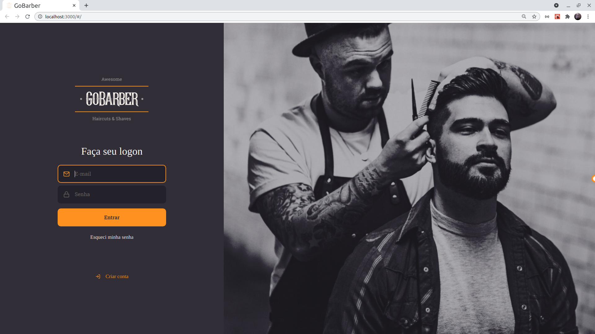
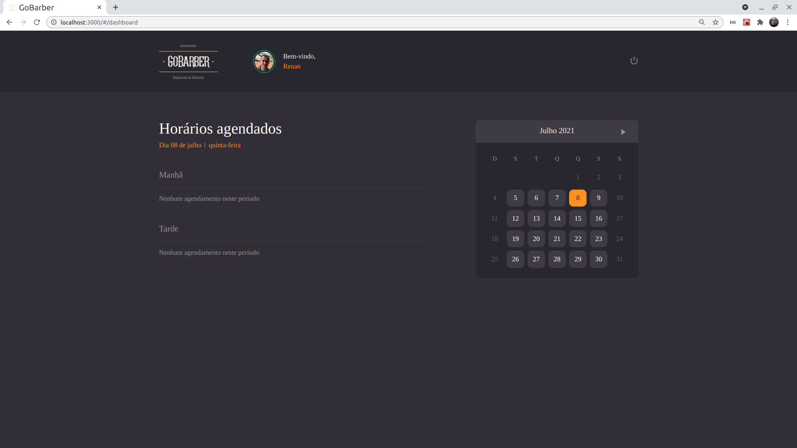

# 
 GoBarber 

### 
Status: Ambiente de Testes (localhost:3000) 🟠 

<h1 align="center">
  
</h1>
<h1 align="center">
  
</h1>

 

## 🧪 Tecnologias

Esse projeto foi desenvolvido com as seguintes tecnologias:

- [React](https://reactjs.org)
- [Next.js](https://nextjs.org/)
- [TypeScript](https://www.typescriptlang.org/)

## 🚀 Como executar

- Clone o repositório
- Instale as dependências com `yarn`
- Inicie o servidor com `yarn start`

Agora você pode acessar [`localhost:3000`](http://localhost:3000) do seu navegador.

* Necessário rodar o node server para conectar ao redis, MongoDB e Postgres.
O projeto Node server pode ser clonado [aqui](https://github.com/renanvzd/goBarber)

## 💻 Projeto

O GoBarber é uma aplicação para organizar os agendamentos dos prestadores de serviço de uma barbearia.

## 🔖 Layout

Você pode visualizar o layout do projeto através [desse link](https://www.figma.com/file/YtcM9ICvZHaPrXbF0L7ggJ/GoBarber-(Copy)?node-id=34%3A1180).
É necessário ter conta no [Figma](http://figma.com/) para acessá-lo.

## 📝 License

Esse projeto está sob a licença MIT. Veja o arquivo [LICENSE](LICENSE.md) para mais detalhes.

---

Copyright: [Rocketseat Bootcamp](https://github.com/rocketseat-education/bootcamp-gostack-apps/tree/master/06-gobarber-web)
